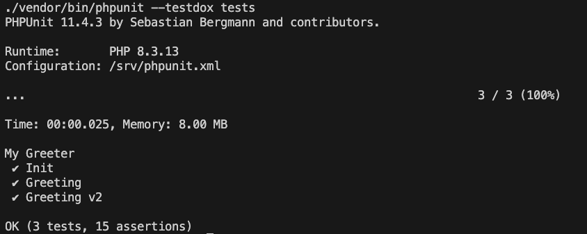

## 测试结果


## 容器部分

### Dockerfile

- 容器中缺少测试使用的make工具

    ```Dockerfile
    # 为容器安装运行测试所需的Make工具
    RUN apk add --no-cache make
    ```

## 思考
1. 我们准备的单元测试类（MyGreeterTest）是否存在问题？
    
    `是`
    
2. 如果问题1你的答案"是"的话，请问有哪些问题？以及你认为针对每个问题应该如何改善？

   1. 测试时区问题
   - **问题**：用户所在时区和服务器时区不同，会导致测试结果和预期不一致
   - **改善**：应该明确测试结果想对应的时区，如果是 **只针对一个时区**，那可以通过`在代码中直接指定时区`，`修改php.ini的时区设置`，`配置服务器的时区`等方法来统一时区问题。 如果是**不同的时区**都要可用，那么可以通过上传`datetime`时间参数或`传入时区参数`等方法来判定输出不同的问候语。

        ```php
        //指定服务所在的时区
        date_default_timezone_set('Asia/Shanghai');
        ```

   2. 未比对输出结果
   - **问题**：在测试脚本中应该明确要输入的参数和想要的结果，而不是简单的有输出即可，应该验证`greeting`方法输出的内容是否是想要的测试结果。
   - **改善**：不同测试阶段验证返回的结果是否为想要的，并指定返回异常情况下的提示信息。
    
        ```php
        //设定预期的返回值并和实际返回值进行比对
        $this->assertEquals("Good morning",$this->greeter->greeting(),"Failed test");
        ```
        
    3. 未测试临界值
      - **问题**：测试中未覆盖时间范围内的临界值，例如正好是 6:00:00、12:00:00、18:00:00 等时间点。
      - **改善**：添加不同的测试用例，包括在临界值上进行测试，以此来扩大测试覆盖范围。
    
        ```php
        //测试晚上和上午的临界时间
        $time = "6:00:00";
        $this->assertEquals("Good morning",$this->greeter->greetingV2($time),"[{$time}]_Failed test");
        
        //测试上午的常规时间
        $time = "8:00:00";
        $this->assertEquals("Good morning",$this->greeter->greetingV2($time),"[{$time}]_Failed test");
        
        //测试上午和下午的临界时间
        $time = "12:00:00";
        $this->assertEquals("Good afternoon",$this->greeter->greetingV2($time),"[{$time}]_Failed test");
        
        //测试下午的常规时间
        $time = "16:00:00";
        $this->assertEquals("Good afternoon",$this->greeter->greetingV2($time),"[{$time}]_Failed test");
        
        //测试下午和晚上的临界时间
        $time = "18:00:00";
        $this->assertEquals("Good evening",$this->greeter->greetingV2($time),"[{$time}]_Failed test");

        //测试晚上的常规时间
        $time = "20:00:00";
        $this->assertEquals("Good evening",$this->greeter->greetingV2($time),"[{$time}]_Failed test");

        //测试凌晨时间
        $time = "1:00:00";
        $this->assertEquals("Good evening",$this->greeter->greetingV2($time),"[{$time}]_Failed test");
        ```
        
    4. 未测试错误输入的场景返回值
      - **问题**：测试未验证错误输入
      - **改善**：添加不同的测试用例，包括错误值的场景，以此来扩大测试覆盖范围。
    
        ```php
        //测试错误时间格式
        $time = "88:88:88";
        $this->assertEquals("Time error",$this->greeter->greetingV2($time),"[{$time}]_Failed test");

        //测试错误时间格式
        $time = "Error Time";
        $this->assertEquals("Time error",$this->greeter->greetingV2($time),"[{$time}]_Failed test");

        //测试错误时间格式
        $time = "123";
        $this->assertEquals("Time error",$this->greeter->greetingV2($time),"[{$time}]_Failed test");

        //测试空
        $time = "";
        $this->assertNotEquals("Time error",$this->greeter->greetingV2($time),"[Empty params]_Failed test");
        ```
        